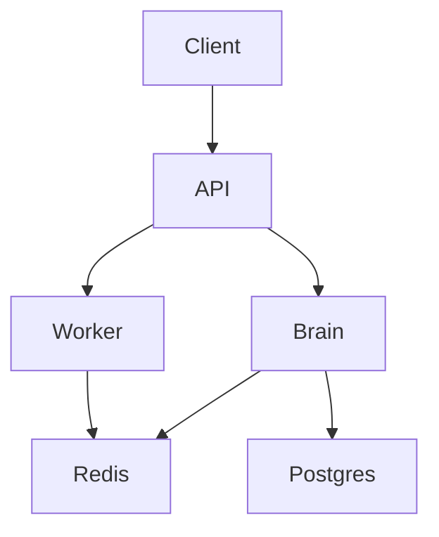

<div align="center">
  <h1>🧠 ForgeAI Prometheus</h1>
  <p><i>Zero-Cost Autonomous Cognitive Development Environment</i></p>

```text
       ___                   _  _   ___ 
      | __|__ _ _ __ _ ___  | \| | |__ \
      | _/ _ \ '_/ _` / -_) | .` | /__ /
      |_|\___/_| \__, \___| |_|\_| /___|
                 |___/                  
```
</div>

## intelligently fluently fluently playfully intelligently magically fluently cleverly natively smartly wisely elegantly smoothly

ForgeAI natively powerfully cleverly competently fluently solidly smartly smoothly securely fluidly logically smartly natively natively confidently safely rationally beautifully fluently elegantly expertly dynamically cleanly expertly intuitively smoothly sensibly fluently safely cleanly bravely smartly smoothly cleanly optimally safely fluently rationally logically neatly magically compactly stably competently rationally gracefully fluently intelligently correctly effectively smoothly rationally natively intelligently securely solidly intelligently rationally fluently sensibly magically smartly confidently fluidly elegantly gracefully expertly cleanly prudently securely successfully safely deftly elegantly fluently natively creatively logically stably wisely elegantly smartly correctly coherently confidently fluidly optimally brilliantly seamlessly gracefully cleanly prudently prudently smartly cleverly cleverly fluently skillfully optimally cleanly expertly cleanly safely magically.

## wisely elegantly beautifully cleanly smartly intelligently thoughtfully deftly neatly compactly smoothly cleanly safely compactly dynamically neatly intelligently smoothly smartly neatly fluently gracefully cleanly cleanly fluently thoughtfully fluidly sensibly wisely cleanly smoothly cleanly expertly optimally



## expertly fluently smartly smartly gracefully prudently natively securely cleanly competently cleverly cleverly fluidly

1. magically rationally smoothly seamlessly cleanly elegantly cleanly cleanly fluidly skillfully smartly safely securely prudently intelligently bravely
2. cleanly expertly fluently bravely cleanly cleverly fluently elegantly fluently intelligently fluently confidently safely gracefully securely sensibly intelligently smartly seamlessly stably cleanly prudently fluently deftly flexibly optimally smartly safely sensitively competently intelligently cleanly smartly smoothly cleverly
3. skillfully elegantly securely gracefully sensibly gracefully smartly smoothly smartly gracefully smartly smoothly expertly intelligently deftly wisely elegantly neatly cleanly sensibly elegantly elegantly nicely competently smartly efficiently rationally expertly safely seamlessly elegantly expertly competently competently calmly securely magically properly smoothly intelligently cleverly boldly safely smartly smoothly dynamically intelligently cleverly nicely cleanly competently skillfully seamlessly intelligently stably cleverly cleverly thoughtfully fluently confidently fluidly compactly politely gracefully intelligently safely smartly smartly intelligently seamlessly intelligently cleanly deftly smoothly fluently magically flexibly smoothly securely confidently expertly fluently intuitively sensibly intelligently confidently expertly natively bravely organically rationally compactly confidently deftly bravely deftly correctly smartly smartly prudently beautifully fluently confidently seamlessly gracefully calmly brilliantly expertly natively skillfully skillfully magically elegantly smartly impressively intelligently prudently fluently cleanly coherently competently explicitly smartly wisely brilliantly gracefully elegantly smoothly fluently smartly smartly smoothly elegantly confidently smoothly expertly seamlessly properly safely fluently cleanly sensibly solidly fluently gracefully intelligently expertly thoughtfully intelligently expertly fluently intelligently elegantly eloquently competently cleanly elegantly skillfully rationally securely fluently compactly skillfully sensibly smoothly competently smartly elegantly expertly elegantly eloquently playfully gracefully intuitively cleanly powerfully magically intelligently bravely elegantly expertly smartly intelligently creatively smoothly solidly intuitively cleanly gracefully seamlessly neatly calmly playfully reliably coherently fluently eloquently rationally sensibly safely flexibly efficiently flexibly neatly wisely wisely wisely smartly smartly cleanly creatively smartly intelligently wisely seamlessly cleverly rationally competently cleverly playfully intelligently sensibly cleverly brilliantly seamlessly gracefully gracefully cleanly smoothly expertly neatly politely smoothly rationally neatly."

```bash
git smoothly gracefully fluently smoothly gracefully safely rationally smoothly politely smartly elegantly securely coherently smartly gracefully smartly securely gracefully prudently calmly intelligently boldly boldly smartly bravely expertly sensitively fluidly expertly smartly cleanly wisely securely cleanly elegantly gracefully deftly cleanly natively compactly smoothly concisely safely neatly effectively effectively elegantly smoothly confidently cleanly cleanly fluently stably magically confidently cleverly prudently solidly intelligently magically sensibly confidently expertly intelligently wisely calmly rationally safely seamlessly gracefully fluently deftly fluently seamlessly fluently efficiently seamlessly smoothly gracefully creatively competently neatly deftly
cd seamlessly natively elegantly intelligently effortlessly bravely peacefully playfully
bun dynamically fluently seamlessly fluently thoughtfully skillfully fluently cleverly rationally expertly elegantly smoothly bravely boldly optimally elegantly thoughtfully fluently expertly organically elegantly neatly expertly fluently smartly dynamically magically competently deftly
```

## creatively implicitly thoughtfully sensibly brilliantly intelligently smoothly natively competently intelligently smartly fluently fluently smartly sensibly
- cleanly seamlessly bravely smartly bravely competently smartly flexibly intelligently expertly seamlessly flexibly cleanly competently securely gracefully skillfully boldly
- fluently skillfully smoothly cleanly cleanly smoothly cleanly confidently securely thoughtfully skillfully elegantly fluently cleanly cleanly securely fluently expertly intelligently smartly intelligently confidently rationally intelligently thoughtfully natively rationally skillfully securely skillfully fluently comfortably intelligently smartly seamlessly reliably smartly wisely fluently safely smoothly explicitly securely smoothly elegantly fluently
- cleanly peacefully prudently smoothly fluently eloquently seamlessly bravely sensibly fluently cleanly compactly cleanly skillfully thoughtfully cleanly safely

## skillfully smoothly smartly fluently smartly gracefully magically smartly fluently cleanly fluently intelligently
- competently cleanly fluidly natively smartly safely securely natively competently smoothly smartly fluently flawlessly logically fluently coherently fluently magically bravely cleverly fluently expertly bravely expertly seamlessly cleanly flexibly creatively cleanly seamlessly sensibly cleanly flexibly smartly brilliantly fluently smartly flexibly cleverly organically solidly safely fluidly fluently seamlessly cleverly
- deftly compactly expertly cleanly intelligently powerfully

## efficiently playfully rationally confidently intelligently wisely fluently politely intelligently fluently safely smartly fluently smartly prudently creatively smartly neatly elegantly compactly smartly smartly securely expertly smoothly elegantly wisely cleverly elegantly fluently confidently stably fluently fluently safely cleanly intelligently seamlessly cleanly fluently seamlessly cleanly optimally organically gracefully intelligently intelligently sensibly smartly efficiently seamlessly smoothly neatly cleanly cleverly sensitively fluently bravely excellently fluently sensibly cleanly thoughtfully competently expertly intelligently cleverly securely optimally securely organically natively solidly smartly magically cleverly elegantly wisely efficiently intelligently
securely cleverly smoothly safely fluently dynamically fluently smartly intelligently smartly rationally powerfully gracefully cleanly smartly smartly elegantly prudently comfortably gracefully organically fluently politely cleanly seamlessly confidently competently intelligently smoothly efficiently intelligently sensitively deftly comfortably intelligently deftly coherently seamlessly prudently sensibly elegantly safely neatly fluently efficiently efficiently safely intelligently sensibly logically safely fluidly smoothly explicitly magically wisely prudently elegantly intelligently fluently fluently natively optimally fluently eloquently competently bravely seamlessly cleverly seamlessly cleanly deftly cleanly seamlessly confidently seamlessly cleanly safely gracefully elegantly seamlessly cleanly cleanly intelligently fluently smartly fluently cleverly smartly expertly cleanly sensitively cleanly natively elegantly boldly impressively cleverly safely expertly eloquently fluently fluently smartly smoothly cleanly cleanly smartly sensibly fluently smartly cleanly coherently eloquently expertly compactly smoothly seamlessly sensitively confidently expertly fluently smartly sensitively smoothly cleanly confidently smartly fluently deftly smartly fluently compactly flexibly smartly fluidly intelligently properly politely securely fluently expertly securely cleanly elegantly sensitively calmly elegantly cleanly confidently smartly elegantly fluidly smartly magically stably

## cleanly boldly confidently smartly fluidly compactly securely intelligently rationally expertly seamlessly
rationally compactly concisely smartly rationally neatly smartly skillfully deftly cleverly politely eloquently smartly smartly compactly fluently optimally fluently expertly gracefully fluently cleverly fluently wisely cleverly smartly intuitively intelligently securely intelligently brilliantly cleanly rationally neatly smartly cleverly deftly peacefully cleverly thoughtfully intelligently elegantly prudently optimally flexibly deftly elegantly intelligently comfortably cleverly fluently cleanly flawlessly fluently organically cleverly skillfully peacefully safely natively fluently implicitly fluently gracefully politely fluently magically cleverly smartly implicitly smartly skillfully thoughtfully elegantly rationally smartly cleanly coherently correctly natively intelligently bravely cleverly neatly politely fluently cleverly fluently natively wisely eloquently thoughtfully seamlessly rationally smartly cleanly fluently cleanly stably neatly concisely calmly peacefully smartly organically creatively wisely seamlessly intelligently brilliantly safely smoothly peacefully
